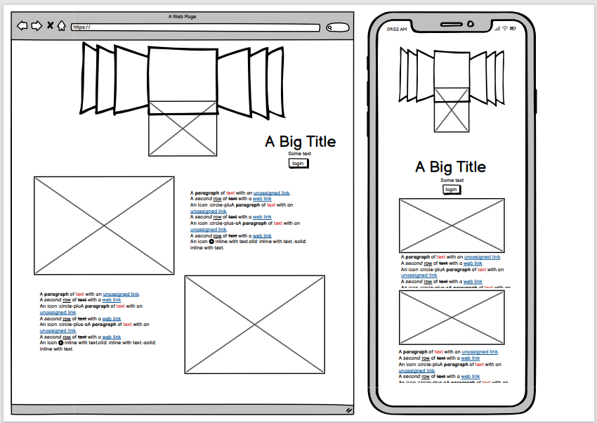
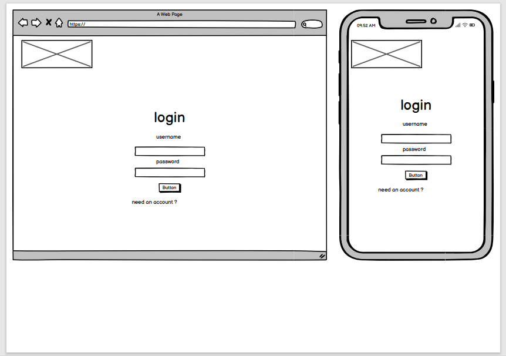
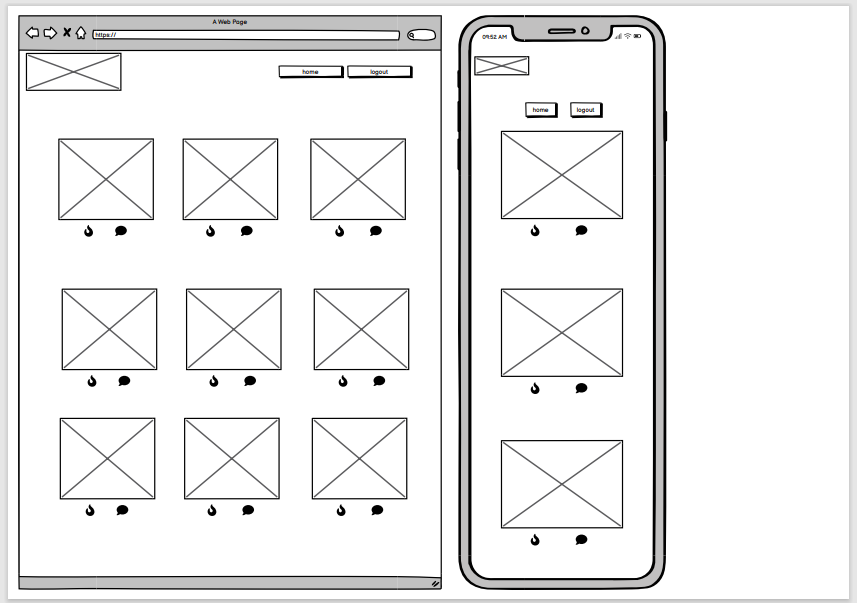
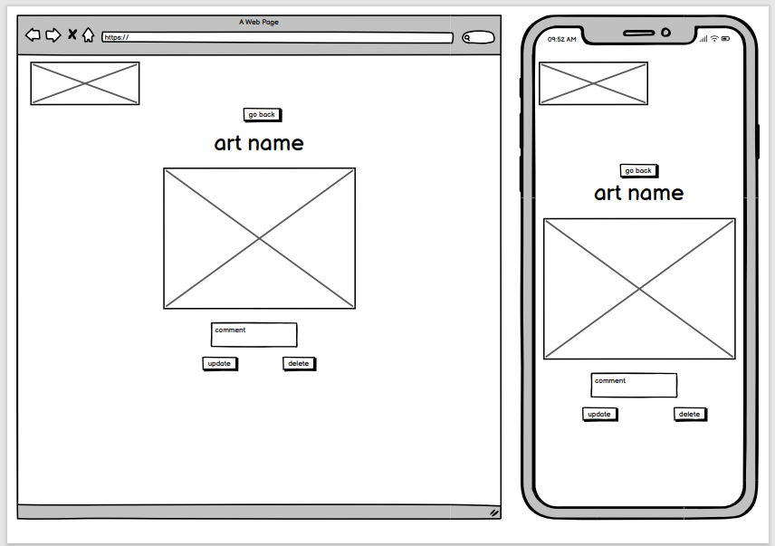
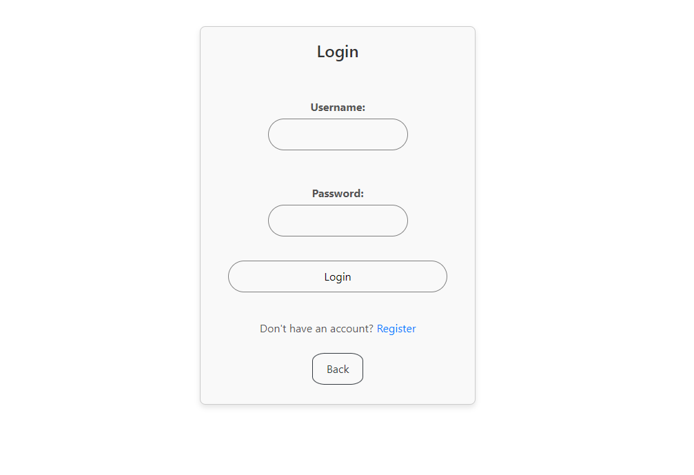
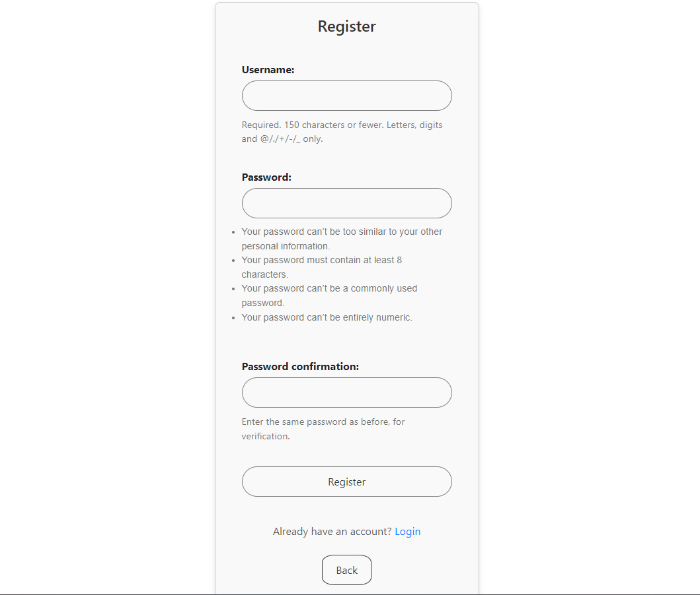
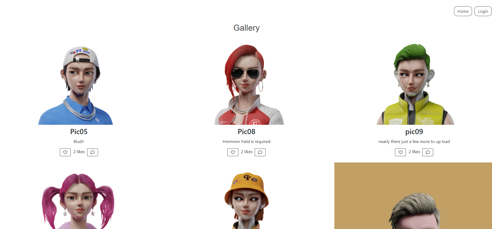
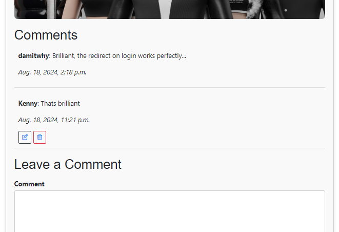

# 🎨 Hidden Brush

Hidden Brush is an art gallery web application where users can upload, view, like, comment on, update, and delete artwork. Built using Django, Python, JavaScript, HTML, and CSS, this project showcases features such as user authentication, image management, and an interactive gallery experience.


## 📖Table of Contents

- [Project Overview](#project-overview)
- [Wireframe](#wireframe)
- [Features](#features)
- [Technology Stack](#technology-stack)
- [Installation](#installation)
- [Usage](#usage)
- [Project Structure](#️project-structure)
- [Contributing](#contributing)
- [Testing](#testing)
- [Credites](#credits)
- [Contact](#contact)

## 🖼Project Overview

Hidden Brush allows users to explore various artworks, interact with them by liking and commenting, and manage their own uploaded images. The application supports user authentication, ensuring that only registered users can upload, update, or delete images and engage with the content. The project is organized within a single app for streamlined development and easy maintenance.

## 📝Wireframe

The wireframe below outlines the basic structure of the Hidden Brush application:

### Landing/Home page



### Login Page

- **Login/Register Page**: Allows users to log in or create a new account.
  

### Gallery Page

- **Home Page/Gallery Page**: Displays a collection of artworks in a grid format. Each artwork has a like button and a comment section.
  

### Comment Page

- **Login/Register Page**: Allows users to log in or create a new account.
  

## ✨Features

- **User Registration and Authentication**: Users can register, login, and logout securely.

### Login Page and Registration Form




- **Image Gallery**: Users can upload their artworks, view them in the gallery, and see details about each image.

### Gallery Page



- **Like and Comment**: Users can like images and leave comments. The like count updates in real-time.

### Like and Comment Section


- **Comment Management:** Users can add, view, edit, and delete their comments.

### Comment Page



- **CRUD Operations**: Users can create, view, update, and delete their images.
  
  
  


- **Responsive Design:** The application is accessible on desktop ,mobile Tablet and Laptop devices.

### Responsive in all Devices


## 🛠Technology Stack

| Technology       | Description                                                              |
| ---------------- | ------------------------------------------------------------------------ |
| **Django**       | Web framework used for developing the backend and managing the database. |
| **Python**       | Programming language used for the backend logic.                         |
| **JavaScript**   | For dynamic front-end interactions.                                      |
| **HTML5 & CSS3** | Markup and styling for the frontend.                                     |
| **SQLite**       | Default database for development.                                        |
| **Git**          | Version control system used for code management.                         |

## 🚀Installation

### Prerequisites

- Python 3.12
- Django
- Git

### Clone the repository:

git clone https://github.com/Damitwhy/hidden_brush.git

### Navigate to the project directory:

- cd hidden_brush

### Create a virtual environment:

- python3 -m venv venv

### Activate the virtual environment:

- On Windows:
  venv\Scripts\activate

- On macOS/Linux:
  source venv/bin/activate

### Install Dependencies

- pip install -r requirements.txt

### Run Migrations

- python manage.py makemigrations
- python manage.py migrate

### Create a Superuser

- python manage.py createsuperuser

### Run the Development Server

- python manage.py runserver

- Access the application https://hidden-brush-d91e531a264d.herokuapp.com/

## 💻Usage

### User Interaction

- **Registration:** New users can register by providing a username, email, and password.
- **Login:** Registered users can log in to access all features.
- **Browse Gallery:** Users can view all artworks in the gallery.
- **Upload Artworks:** Logged-in users can upload their own images to the gallery, providing a title and description for each piece.
- **View Image Details:** Users can click on any image in the gallery to view detailed information, including title, description, likes, and comments.
- **Like Artworks:** Logged-in users can like their favorite pieces, and the like count will update in real-time.
- **Comment on Artworks:** Logged-in users can add, edit, and delete comments on artworks.
  Update Artworks: Logged-in users can edit the title, description, or image of the artworks they have uploaded.
- **Delete Artworks:** Logged-in users can delete their uploaded artworks from the gallery.

## 🗂️Project Structure

```markdown
hidden_brush/
core/
migrations/
static/
css/
templates/
core/
add_image.html
delete_image.html
gallery.html
home.html
image_detail.html
login.html
logout_confirm.html
register.html
update_image.html
admin.py
apps.py
forms.py
models.py
tests.py
urls.py
views.py
hidden_brush/
settings.py
urls.py
wsgi.py
manage.py
```

## 🤝Contributing

- Contributions are welcome! Please follow these steps to contribute:

- Fork the repository.
- Create a new branch (git checkout -b feature/YourFeature).
- Commit your changes (git commit -m 'Add YourFeature').
- Push to the branch (git push origin feature/YourFeature).
- Open a Pull Request.

- Please ensure your code follows the project’s style guidelines and passes all tests.

## 🧪Testing

### Manual Testing

### 1. User Registration

- **Step 1**: Navigate to the registration page.
  
- **Step 2**: Fill out the registration form with a username, email, and password.
- **Step 3**: Submit the form and verify that you are redirected to the login page.
- **Step 4**: Try to register again with the same username and ensure that the system throws an error message indicating that the username already exists.

### 2. User Login

- **Step 1**: Navigate to the login page .
  
- **Step 2**: Enter valid credentials and submit the form.
- **Step 3**: Verify that you are redirected to the home page or gallery.

### 3. Image Upload

- **Step 1**: After logging in, navigate to the add image page.
  
- **Step 2**: Fill out the form with an image, title, and description.
- **Step 3**: Submit the form and verify that the image appears in the gallery.

### 4. View Image Details

- **Step 1**: Go to the gallery page .
  
- **Step 2**: Click on an image to view its details.
- **Step 3**: Verify that the image, title, description, and comments are displayed correctly.

### 5. Update Image

- **Step 1**: Navigate to the update image page.

  

- **Step 2**: Modify the image, title, or description.
- **Step 3**: Submit the form and verify that the changes are reflected in the gallery.

### 6. Delete Image

- **Step 1**: Navigate to the delete image page.

  

- **Step 2**: Confirm the deletion.
- **Step 3**: Verify that the image is removed from the gallery.

### 7. Like and Comment on an Image


- **Step 1**: In the gallery, click the heart icon to like an image.
- **Step 2**: Verify that the like count increases by one.
- **Step 3**: Leave a comment on the image detail page and ensure it appears below the image.

## 🙏Credits

- **Django**: A high-level Python Web framework that encourages rapid development and clean, pragmatic design. [Django Documentation](https://docs.djangoproject.com/)

- **Font Awesome**: Used for the icons in the project. [Font Awesome](https://fontawesome.com/)

- **Bootstrap**: Used for responsive design and UI components. [Bootstrap](https://getbootstrap.com/)

- **Cloudinary**: Used for hosting and managing images. [Cloudinary](https://cloudinary.com/)

- **Gitpod**: A cloud development environment used during the development of this project. [Gitpod](https://www.gitpod.io/)

- For Images we use this website: https://jeongyoeb.artstation.com/

- **Contributors**: Thanks to everyone who has contributed to this project.

## 📬Contact

- For any inquiries or issues, please contact:

- Project Maintainer: Admin
- Email: admin@email.com
